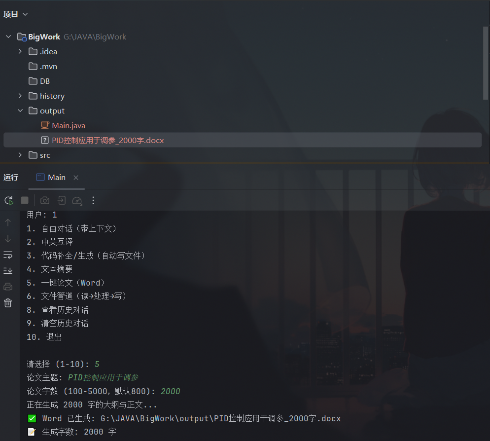
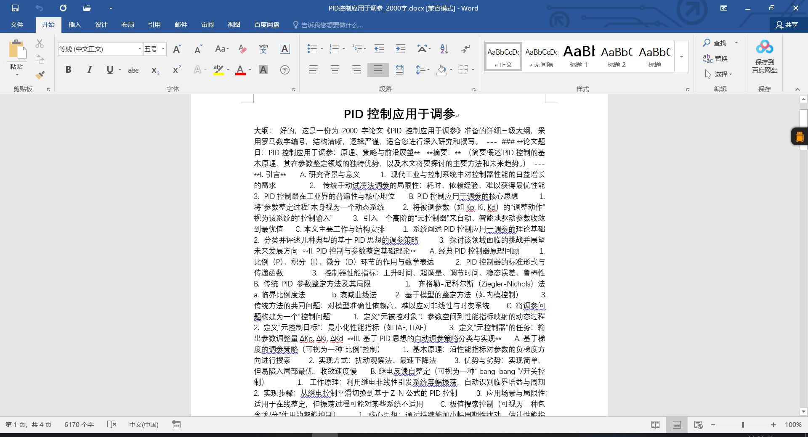

# 基于DeepSeek API的智能助手
#### 计科2313 20252160A1301傅天吉
## 环境配置
### 数据库配置
数据库使用SQL  server本地部署，使用项目前请运行**SQL server**的服务。
使用管理员用户sa，用户密码123进行登录，所以请确保这个用户可以登录并设置了该密码。

数据库无需手动配置，如果没有创建数据库会自动创建，功能集成在类`DatabaseConfig`类中,但请务必完成上面操作。

### API配置
Deepseek的API在main的最前面。不能用了可能是欠费或者是我把key删了

## 功能展示
### 1
### 2
### 3
### 4
### 5 一键论文功能
使用论文生成功能生成一篇论文，等待时间较长，请耐心等待，等待时间取决于AI回复时间。

生成结果如图，存在md排版问题。正在改进。

### 6 